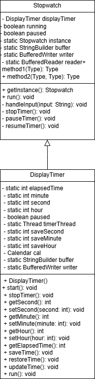

> # Stop watch

Stopwatch Game

<br>

### 게임 설명
> - 타이머 시작: 타이머가 1초 단위로 증가하며 시간 경과가 표시됩니다.
> - 타이머 멈춤: 사용자는 타이머를 멈추어 최종 시간을 확인할 수 있습니다.
> - 일시 정지 및 재개: 게임 진행 중에 타이머를 일시 정지하고, 다시 시작할 수
> - 시간 저장 및 복원: 원하는 시간에 저장하여 나중에 해당 시점으로 복원할 수 있습니다.
<br><br>

### Class Diagram


<br><br>

### Demo


<br><br>

### Tree
```
📦src
 ┣ 📂manager
  ┣ 📜Stopwatch.java
  ┗ 📜DisplayTimer.java

```
